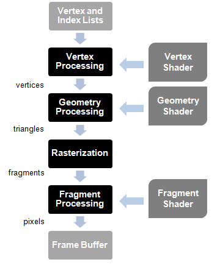

# 3D Java Game Project Progress Report

## Day 1
### Setting up the project
- Imported LWJGL3 library in order to kickstart the project off.
- The project is created and ran within Eclipse IDE environment, and for consistency sake, will be executed in 1.8 Java Environment.
- Using **Threads** to run and execute the main functions for the game.
    - **Threads** allows a program to operate more efficiently by doing multiple things at the same time, basically running different tasks on different threads allows these tasks to be ran concurrently along with the main program without interrupting the main thread and slowing down the program.

### Setting up Window.java and Input.java classes
- Setup the `Window.java` class so that the main program can set up a window that can pop up on the screen, although there is an error where the window is non-responsive and can't be closed unless the program is forcefully terminated.
    - The solution to this problem is to just ensure that within the `run()` method that the loop is checking whether the window should close or not with the built-in `.shouldClose()` method.
- The window created by `Window.java` would also not be rendering anything.
    - This is caused by not having any specifications within the class to actually render graphics, a fix is to just call `GLFW.glfwSwapBuffers(window)` so that the program actually knows to render graphics within the window.
- Setup `Input.java`, this class processes all the possible user inputs, mouseButtons, keyboardKeys and mousePositions in order to allow for the main program to accept user inputs and processes them through methods setup within the class itself.

### Finalizing Window.java and Input.java classes
- Implemented additional feature within the `Window.java` class so that it is resizable, by using `GLFWWindowSizeCallback()`, we can ensure that the windows are properly resizable and everything rendered within should resize accordingly. And by implementing resizability, we can also make fullscreen capability for the window.
- Also enabled `GL11.GL_DEPTH_TEST` in preparation for future 3D capability.
- Implemented mouse scrolling check so that mouse scrolls is a function in the program, through the inclusion of `GLFWScrollCallback()`

## Day 2
### Revamping the project
- Although the project started off on a great note, unfortunately the [CodingAP](https://www.youtube.com/@CodingAP) channel has discontinued their LWJGL3 tutorial and it's proven difficult to follow a none future-proof tutorial playlist. 
    - Therefore to remedy the situation, all codes are now written through a hybrid style of following both [ThinMatrix](https://www.youtube.com/@ThinMatrix/featured) and [3D Game Development with LWJGL3 by Antonio Hernández Bejarano](https://github.com/lwjglgamedev/lwjglbook-bookcontents).

### Rendering, Shaders and Meshes
- Following Antonio's guide, and introducing small reworks of Antonio's implementation throughout the project, utilizing ThinMatrix's codes, I am able to render a basic yellow triangle onto the window opened on our screen. Throughout today's journey, I was able to learn a plethora of interesting points and new things to add to my arsenal.
- Within OpenGL 2.0, we are introduced a programmable graphics pipelines, in which our program follows in order to render anything onto the screen.



```
The rendering starts taking as its input a list of vertices in the form of Vertex Buffers. But, what is a vertex? A vertex is any data structure that can be used as an input to render a scene. By now you can think as a structure that describes a point in 2D or 3D space. And how do you describe a point in a 3D space? By specifying its x, y and z coordinates. And what is a Vertex Buffer? A Vertex Buffer is another data structure that packs all the vertices that need to be rendered, by using vertex arrays, and makes that information available to the shaders in the graphics pipeline.

Those vertices are processed by the vertex shader whose main purpose is to calculate the projected position of each vertex into the screen space. This shader can generate also other outputs related to color or texture, but its main goal is to project the vertices into the screen space, that is, to generate dots. 

The geometry processing stage connects the vertices that are transformed by the vertex shader to form triangles. It does so by taking into consideration the order in which the vertices were stored and grouping them using different models. Why triangles? A triangle is like the basic work unit for graphic cards. It’s a simple geometric shape that can be combined and transformed to construct complex 3D scenes. This stage can also use a specific shader to group the vertices.

The rasterization stage takes the triangles generated in the previous stages, clips them and transforms them into pixel-sized fragments. Those fragments are used during the fragment processing stage by the fragment shader to generate pixels assigning them the final color that gets written into the framebuffer. The framebuffer is the final result of the graphics pipeline. It holds the value of each pixel that should be drawn to the screen.
```

- Within Antonio's guide, he utilizes a library import **(ShaderModuleData)**, which I have no access over as it requires an execution environment I failed to import(due to following a different guide early on, CodingAP required a JavaSE-1.8, whereas Antonio required JavaSE-17 or beyond). This became a problem as I couldn't identify early on what the purpose of this library was, as I was about to give up, I decided instead of just blindly following Antonio's guide step-by-step, I would just read the entire chapter through and see what the **ShaderModuleData** object was being used for. I quickly realize that the object was used to read in fragment and vertex shaders data from file and to store each of these read data to its respective GL20 type integers.
    - Identifying this similarity, I quickly opened one of [ThinMatrix videos on "Coloring using Shaders"](https://youtu.be/4w7lNF8dnYw) and immediately found a solution to this. His code is extremely similar to Antonio's in handling their shaders, the only difference is that Antonio is using a pre-existing library available to him. Therefore after identifying this, I quickly got to work on implementing and reading the shader files, and was finally able to replicate ThinMatrix's shader code and incorporate them into Antonio's shader codes.

- Within Antonio's guide and codes, instead of a RawModel, as named and identified by ThinMatrix in his video, [VAOs and VBOs](https://youtu.be/WMiggUPst-Q), Antonio named them as [Meshes](https://en.wikipedia.org/wiki/Polygon_mesh), which is a more familiar terminology since I have worked with meshes quite a lot when I was doing Unity/UE. The utilisation of the terminology meshes allowed me to identify very quickly that we are working with VAOs and VBOs, and that I will be able to cross-reference Antonio's guide to ThinMatrix's video, which allowed me to amalgamate their codes into what currently is within the `Mesh.java` class.

- Another problem that was present when I was trying to replicate Antonio's code within my project, is that for the line:
    ```java
    FloatBuffer positionsBuffer = stack.callocFloat(positions.length);
    positionsBuffer.put(0, positions);
    ```
    The compiler was having trouble attempting to compile the 2nd line as for some reason whenever `positionsBuffer.put(0,positions)` is resolved, the compiler keeps throwing out complaints that it does not take in a float array as a 2nd input. Reading through the OracleDoc for `FloatBuffer`, there definitely do not exist a `put()` method for FloatBuffer that takes in both an integer and a float array input, therefore to remedy this problem, I replicated ThinMatrix's code on how he loads `RawModel(s)` onto his scene and stores data in float buffer and the problem was resolved immediately.


```java
package core.graphic;

import java.util.*;
import java.nio.FloatBuffer;

import org.lwjgl.BufferUtils;
import org.lwjgl.opengl.GL30;
import org.lwjgl.system.MemoryStack;

public class Mesh {
	
	private int numVertices;
	private int vaoID;
	private List<Integer> vboIDList;
	
	public Mesh(float[] positions, int numVertices) {
		try(MemoryStack stack = MemoryStack.stackPush()) {
			this.numVertices = numVertices;
			vboIDList = new ArrayList();
			
			vaoID = GL30.glGenVertexArrays();
			GL30.glBindVertexArray(vaoID);
			
			//positions VBO
			int vboID = GL30.glGenBuffers();
			vboIDList.add(vboID);
			FloatBuffer positionsBuffer = storeDataInFloatBuffer(positions);
			GL30.glBindBuffer(GL30.GL_ARRAY_BUFFER, vboID);
			GL30.glBufferData(GL30.GL_ARRAY_BUFFER, positionsBuffer, GL30.GL_STATIC_DRAW);
			GL30.glEnableVertexAttribArray(0);
			GL30.glVertexAttribPointer(0, 3, GL30.GL_FLOAT, false, 0, 0);
			
			GL30.glBindBuffer(GL30.GL_ARRAY_BUFFER, 0);
			GL30.glBindVertexArray(0);
		}
	}
	
	public void cleanup() {
        vboIDList.forEach(GL30::glDeleteBuffers);
        GL30.glDeleteVertexArrays(vaoID);
	}

	public int getNumVertices() {
		return numVertices;
	}

	public final int getVaoID() {
		return vaoID;
	}
	
	private FloatBuffer storeDataInFloatBuffer(float[] data) {
		FloatBuffer buffer = BufferUtils.createFloatBuffer(data.length);
		buffer.put(data);
		buffer.flip();
		return buffer;
	}
}
```

- After the meshes, the only thing remaining is to render the meshes onto a `Scene` object and have a `SceneRender` object to render, and then include the `SceneRender` object within the `Render` class.

